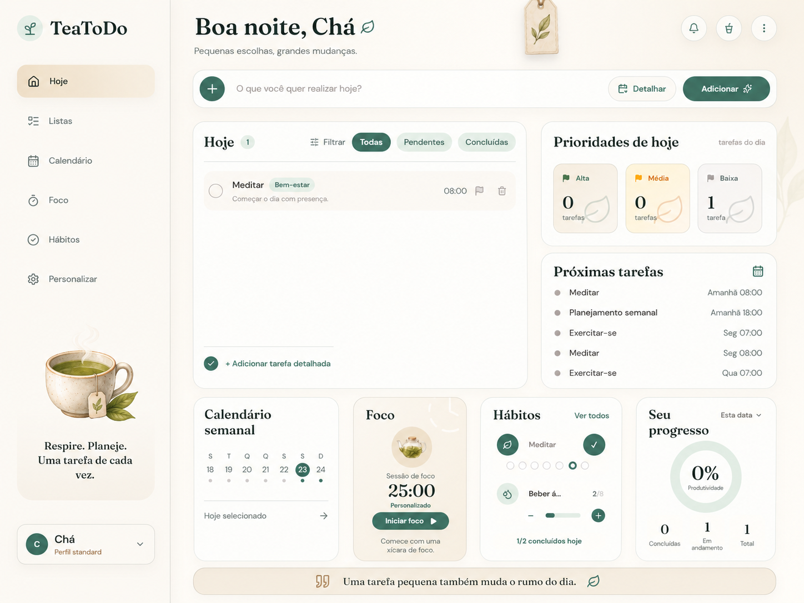
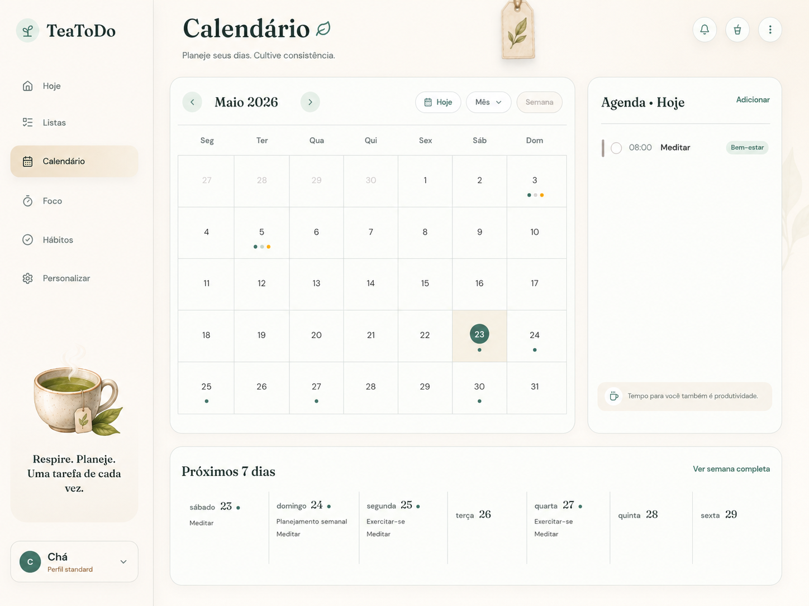
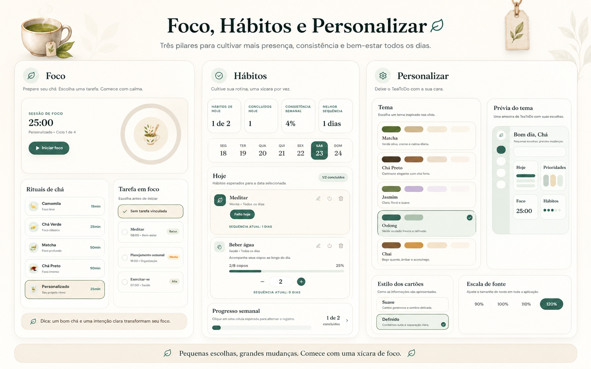

# TeaToDo

<p align="center">
  
</p>

<h1 align="center">TeaToDo</h1>

<p align="center">
  <strong>Pequenas escolhas, grandes mudanças.</strong>
</p>

<p align="center">
  Uma aplicação de produtividade local-first inspirada na calma do ritual do chá.
  O TeaToDo reúne tarefas, listas, calendário, foco, hábitos e personalização em uma interface acolhedora,
  elegante e pensada para tornar a organização diária mais leve.
</p>

<p align="center">
  
  
  
  
</p>

<p align="center">
  
</p>

---

## Sobre o Projeto

O TeaToDo nasceu para ser mais do que uma lista de tarefas. A proposta é criar um ambiente de organização pessoal que combine produtividade com calma, oferecendo ferramentas para planejar o dia, acompanhar hábitos, manter o foco e organizar listas sem depender de conta, servidor ou internet.

A aplicação funciona de forma local-first: os dados ficam salvos no próprio navegador por meio do `localStorage`. Isso torna a experiência rápida, simples e acessível para uso pessoal.

---

## Previa

<p align="center">
  
</p>

<p align="center">
  <em>Painel diario com tarefas, prioridades, foco, habitos, calendario semanal e progresso.</em>
</p>

---

## Recursos

### Hoje

- Saudação dinâmica baseada no horário local.
- Criação rápida de tarefas.
- Criação detalhada por modal.
- Edição, conclusão e exclusão de tarefas.
- Suporte a subtarefas.
- Prioridade, categoria, data e horário.
- Filtros por tarefas pendentes, concluídas ou todas.
- Cards de prioridades do dia.
- Próximas tarefas.
- Calendário semanal.
- Card de foco.
- Card de hábitos.
- Card de progresso por período.
- Frase motivacional diária em português.

### Calendário

- Visualização mensal.
- Agenda do dia selecionado.
- Próximos sete dias.
- Prazos importantes.
- Notas de planejamento.
- Rotinas recorrentes.
- Geração automática de tarefas a partir de rotinas, evitando duplicações.

<p align="center">
  
</p>

### Foco

- Timer de foco.
- Presets inspirados em chás.
- Pausa curta e pausa longa.
- Ciclos antes da pausa longa.
- Pausar, retomar, reiniciar, finalizar e interromper sessão.
- Associação de foco com uma tarefa.
- Histórico de sessões.
- Estatísticas de foco do dia.
- Meta diária de foco.
- Configurações de som, notificações e auto-início.

### Hábitos

- Criação de hábitos personalizados.
- Presets de hábitos.
- Frequência diária, dias úteis ou dias específicos.
- Hábitos de check ou quantidade.
- Registro por data.
- Incremento e decremento de progresso.
- Grade semanal.
- Estatísticas do dia e da semana.
- Sequências e streaks.
- Ativar, desativar, editar e excluir hábitos.

<p align="center">
  
</p>

### Listas

- Modelos para lista simples, lista de compras e lista de estudos.
- Busca e filtros por tipo ou status.
- Favoritar, arquivar, duplicar e excluir listas.
- Detalhe editável da lista.
- Itens com categoria, prioridade, data e observação.
- Campos específicos para compras, como preço, quantidade, unidade, categoria, orçamento e totais automáticos.
- Campos específicos para estudos, como tópico, disciplina, status, dificuldade, tempo estimado e data.

### Personalização

- Temas visuais inspirados em chás.
- Estilo dos cards.
- Escala de fonte.
- Densidade da interface.
- Forma dos ícones.
- Preset padrão de foco.
- Preferências de notificação.
- Papel de parede.
- Upload de imagem personalizada.
- Perfil local com nome, e-mail, fuso horário, idioma e avatar.
- Prévia visual do tema.

---

## Identidade Visual

O TeaToDo utiliza uma estética suave, limpa e acolhedora. A interface foi pensada para transmitir calma, foco e organização, fugindo da sensação fria e genérica de muitos aplicativos de produtividade.

- Paleta inspirada em chás: matcha, oolong, chá preto, jasmim e chai.
- Cards arredondados com sombras leves.
- Fundos claros e textura visual delicada.
- Ícones minimalistas.
- Tipografia elegante para títulos.
- Tipografia legível para textos, botões, formulários e navegação.
- Componentes com aparência orgânica e pouco agressiva.

### Fontes

- `Fraunces` para títulos e elementos de destaque.
- `DM Sans` para textos, botões, formulários e navegação.

---

## Dados Locais

O TeaToDo não depende de autenticação ou banco externo nesta fase. Todos os dados são armazenados localmente no navegador.

- Salvamento via `localStorage`.
- Exportação de backup em JSON.
- Importação de backup em JSON.
- Limpeza completa dos dados locais.
- Normalização dos dados salvos para evitar que informações antigas ou corrompidas quebrem a aplicação.

---

## Responsividade

- Navegação lateral no desktop.
- Navegação inferior no mobile.
- Layout responsivo.
- Modal com fundo desfocado.
- Scrollbar personalizada.
- Cards adaptáveis.
- Hierarquia visual clara.

---

## Tecnologias

- React 19
- TypeScript
- Vite
- Tailwind CSS
- React Router
- Framer Motion
- Lucide React
- date-fns
- LocalStorage

---

## Estrutura

```bash
TeaToDo/
├── assets/
├── docs/
│   └── readme/
├── src/
│   ├── components/
│   ├── config/
│   ├── context/
│   ├── hooks/
│   ├── pages/
│   ├── types/
│   └── utils/
├── index.html
├── package.json
├── tailwind.config.js
└── vite.config.ts
```

---

## Como Executar

```bash
git clone https://github.com/ChaMatteCoder/TeaToDo.git
cd TeaToDo
npm install
npm run dev
```

A aplicação ficará disponível localmente no endereço informado pelo terminal.

### Scripts úteis

```bash
npm run dev
npm run build
npm run preview
npm run lint
npm run qa
```

---

## Backup e Restauração

Como o TeaToDo trabalha com dados locais, o usuário pode exportar e importar seus próprios dados.

- Exportar: gera um arquivo `.json` contendo tarefas, listas, hábitos, sessões de foco, preferências e demais dados locais.
- Importar: restaura os dados a partir de um backup `.json`.
- Limpar dados: remove todos os dados salvos no navegador e reinicia a experiência local.

---

## Roadmap

- [x] Tarefas com prioridade, categoria, data e horário.
- [x] Modal de criação detalhada.
- [x] Subtarefas.
- [x] Calendário mensal.
- [x] Rotinas recorrentes.
- [x] Timer de foco.
- [x] Histórico de sessões de foco.
- [x] Hábitos com check e quantidade.
- [x] Listas simples, de compras e de estudos.
- [x] Personalização visual.
- [x] Backup e restauração local.
- [ ] Melhorias avançadas de responsividade.
- [ ] Mais animações e microinterações.
- [ ] Modo instalação/PWA.
- [ ] Sincronização opcional em nuvem.
- [ ] Dashboard de estatísticas avançadas.
- [ ] Mais temas visuais.
- [ ] Testes automatizados.

---

## Conceito

> Produtividade não precisa parecer pressão.
> Ela pode ser leve, bonita e construída uma pequena tarefa por vez.

---

## Autor

Desenvolvido por **Matheus Fernandes**.

<p align="left">
  <a href="https://github.com/ChaMatteCoder">
    
  </a>
  <a href="mailto:chamattheus@gmail.com">
    
  </a>
</p>

---

<p align="center">
  <strong>TeaToDo</strong> - organize seu dia com calma.
</p>
